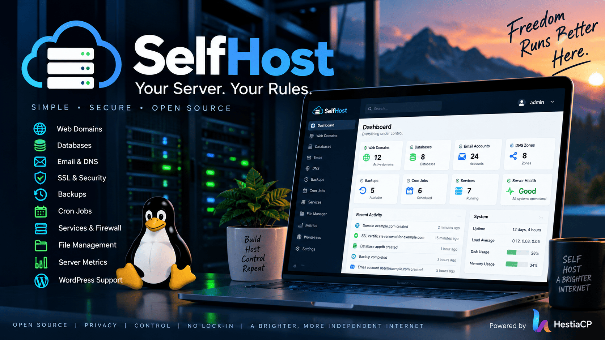

<p align="center">
  
</p>

# SelfHost

**A secure, open-source control plane for your own server.**

SelfHost is a modern TypeScript interface for managing common self-hosted infrastructure without turning the web application into a general-purpose root shell. The project is built around explicit, reviewable integrations with HestiaCP and optional infrastructure providers.

## Why SelfHost

Running your own VPS should not require choosing between an expensive hosting panel and manually administering every routine task over SSH. SelfHost aims to provide a focused interface for websites, domains, DNS, SSL, email, databases, backups, cron jobs, files, WordPress, server health and related operations while keeping the underlying privilege boundary narrow and auditable.

SelfHost does not try to reimplement the services a mature hosting stack already provides. The initial integration uses HestiaCP as the host-management layer and presents those capabilities through a modern application architecture.

## Principles

- **Self-hosted by default.** Your server remains under your control.
- **Least privilege.** Administrative operations are explicit and constrained; arbitrary remote shell execution is not a product feature.
- **Safe configuration.** Credentials and infrastructure identifiers are runtime configuration, never source defaults.
- **Provider-aware, not provider-locked.** Cloud integrations are optional adapters.
- **Reviewable infrastructure code.** Security-sensitive boundaries stay small, typed, documented and tested.
- **Reproducible development.** A contributor should be able to build and test the project without access to the maintainer's infrastructure.

## Capabilities

SelfHost's hardened control-plane foundation includes typed integrations for websites and domains, SSL, DNS zones and records, mail domains and accounts, databases, backups, cron inventory, services and firewall inventory. Higher-risk operations are intentionally introduced only when their authorization and privilege boundaries are narrow enough to review and test.

## Architecture

```text
Browser
   |
   v
SelfHost web application
   |
   +-- authentication / authorization
   +-- validation / rate limiting
   |
   v
Application services
   |
   +-- Hestia adapter --> constrained privileged runner --> Hestia CLI
   +-- Files adapter  --> constrained filesystem operations
   +-- OCI adapter    --> optional cloud integration
   +-- Metrics / logs / uptime
```

See [`docs/ARCHITECTURE.md`](docs/ARCHITECTURE.md) for trust boundaries and design rules.

## Configuration

No real server identifiers or credentials are included. Start from [`.env.example`](.env.example); cloud integrations are optional and must be configured explicitly. See [`docs/CONFIGURATION.md`](docs/CONFIGURATION.md) and [`docs/DEVELOPMENT.md`](docs/DEVELOPMENT.md) for configuration and contributor setup.

## Security

SelfHost is infrastructure software and should be treated as security-sensitive. Please read [`SECURITY.md`](SECURITY.md) and [`docs/SECURITY_MODEL.md`](docs/SECURITY_MODEL.md) before deploying or reporting a vulnerability. The source migration audit is documented in [`docs/SOURCE_AUDIT.md`](docs/SOURCE_AUDIT.md).

## Contributing

Contributions are welcome. Start with [`CONTRIBUTING.md`](CONTRIBUTING.md), follow the security boundaries documented in the repository, and keep privileged operations explicit, typed and testable.

## Maintainer

Created and maintained by **Taiwo David Dayomola, Senior Software Engineer**.

## License

SelfHost is licensed under the [Apache License 2.0](LICENSE).
